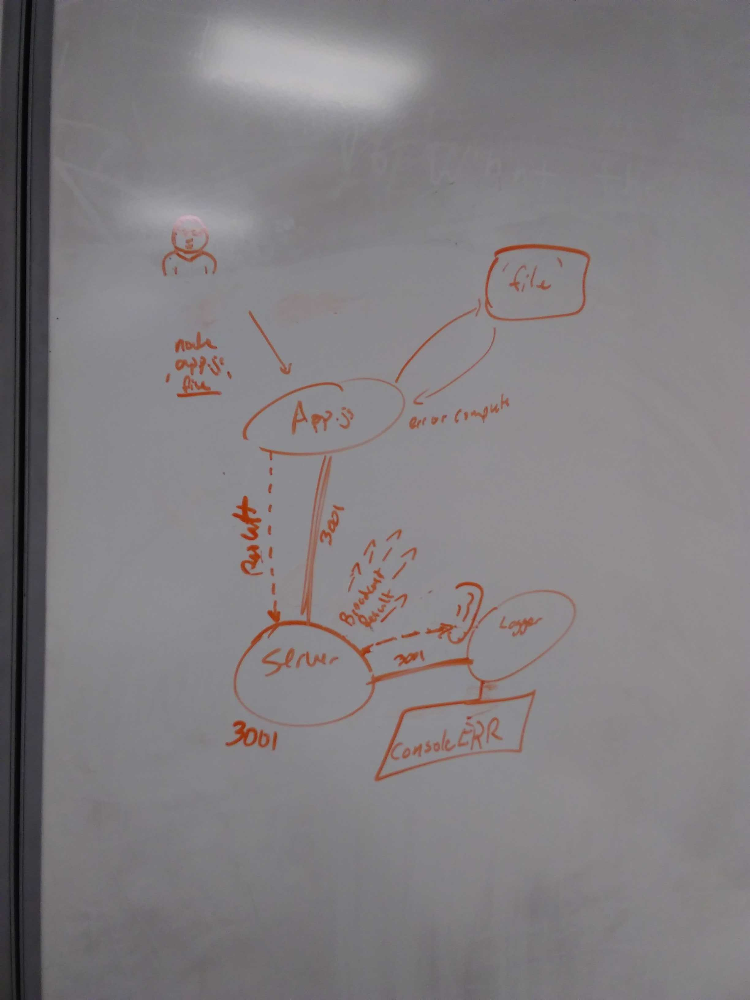

 LAB 18
=================================================

## SOCKET.IO IMPLEMENTATION

### Author: Aaron Ferris

### Links and Resources
* [PR](https://github.com/codefellows-js-401d29-aaron-ferris/lab18/pull/1)  
* [travis](https://www.travis-ci.com/codefellows-js-401d29-aaron-ferris/lab18)   
  
  
#### Documentation
* [jsdoc](https://github.com/codefellows-js-401d29-aaron-ferris/lab87/tree/submission/docs)  

### Modules
#### `app.js`
##### Exported Values and Methods

###### `io.connect`
 * Connects our socket to server 3001 in localhost

###### `saveFile`
 * converts readit into a testable function
 * readit is promisified version of fs.readfile
 * takes in a file

###### `convertBuffer`
 * takes in buffer. 
 * converts it to a string and uppercase

###### `savedStatus`
 * Takes in file
 * writes to server file was saved

###### `throwErr`
 * Takes in error
 * logs the error

###### `alterFile`
 * takes in file
 * runs loadfile
 * then runs convertbuffer
 * then runs savefile
 * then runs savedmsg
 * if error runs throwErr

###### `loadFile`
 * makes writeit into a testable function
 * writeit converts readfile into a promise
 * takes in a file destination and a buffer

 ###### `socket.on 'err'/'saved`
 * listens for error or saved to terminate app

#### `logger.js`
##### Exported Values and Methods

###### `socket.on saved`
 * listens for saved event, and console logs the result

###### `socket.on err`
 * listen for an error error event, and it console errors

#### `server.js`
##### Exported Values and Methods

###### `io.on connection`
 * runs the socket.on method when heard
 * the soccket on method takes in a buffer, converts it into text and splits it, and outputs the changed info as listenable information

 
### Setup
#### Requirements
* run a npm i in the base folder

#### Running the app
* in base folder run in different terminals
  * `nodemon`
  * `nodemon logger.js`
  * run command to execute
  *  `node app.js _filename_`
  *  example `node app.js ./files/test.txt`
* on a error, logger shoudl console error the error
* on a success, logger should console log the file was saved
  
#### Tests
* Based on time, I didn't get to testing

#### UML

